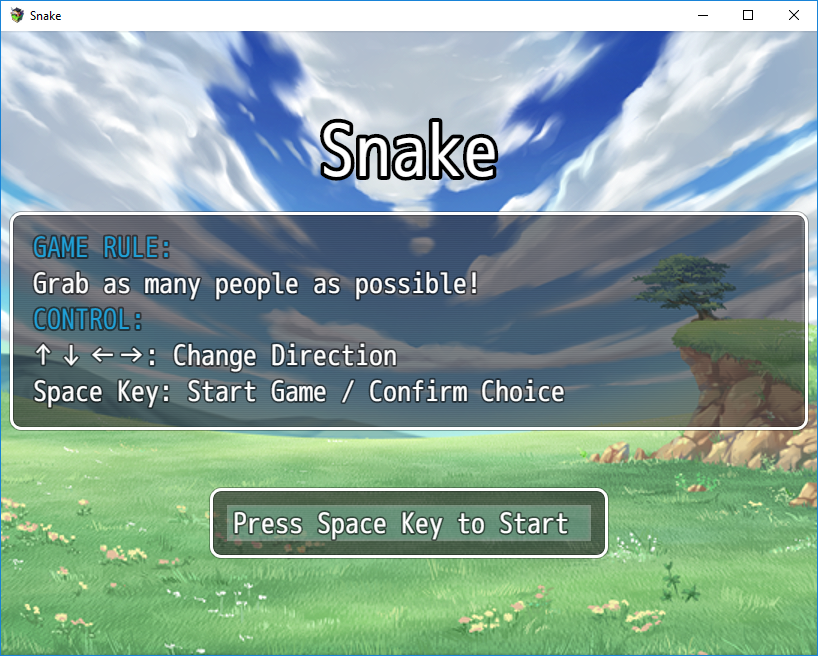
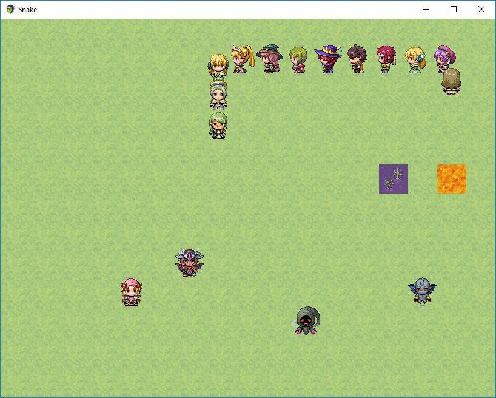
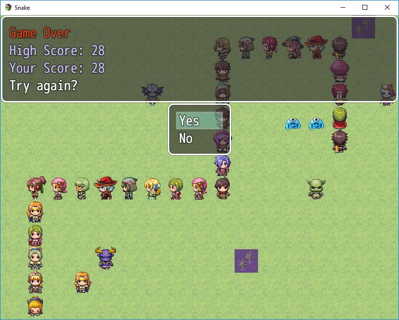

# Snake
by fsworld009 with RPG Maker MV
©2015 KADOKAWA CORPORATION./YOJI OJIMA 

[Play the game](https://fsworld009.gitlab.io/rmmv-snake/)

# Screenshots

# Open this project in RPG Maker MV

This project uses default assets from the maker and is not included in this repo.

To open this project in RPG Maker MV, you need to:
1. create a new 1.6.1 project in RPG Maker MV
2. close the project
3. delete `data` folder in the new project folder
4. copy all files under `src` folder into the new project folder
5. open the new project again, it should be the source code for this game instead.
